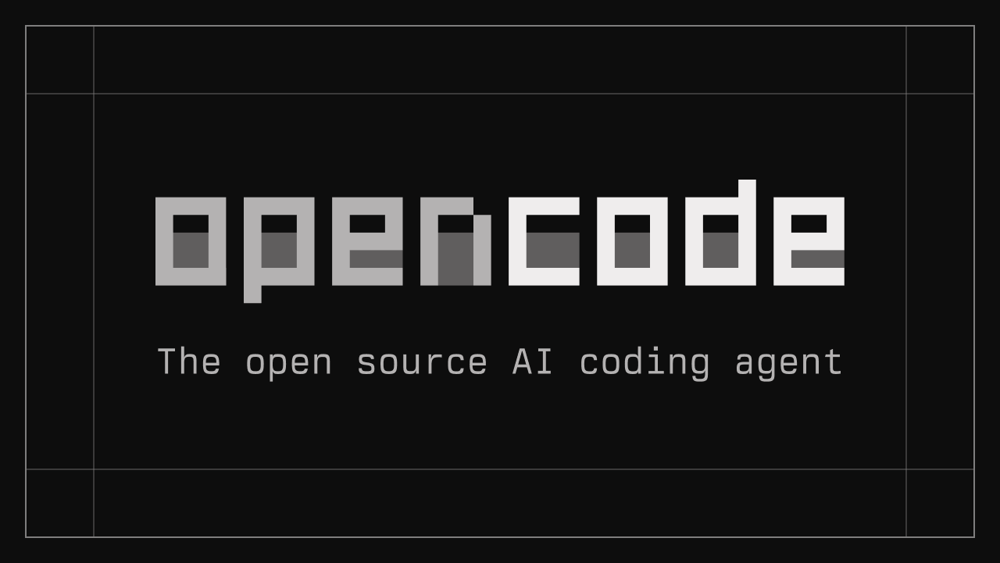

<p align="center">
  
</p>

# applyr

> An automated, single-user job-application agent for internship and
> new-grad roles. Scrapes public boards, deduplicates against local
> history, tailors a resume and cover letter, applies on your behalf,
> routes per-outcome updates to Discord, and appends one row per
> success to a Google Sheet tracker.
>
> **Build 0.8.0a** — see [Release notes](docs/RELEASE.md) and
> [Changelog](docs/CHANGELOG.md). The build marker is also shown in
> the TUI side-panel footer.

applyr is built on an LLM harness — your coding agent — chosen at
install time. The harness **orchestrates**; deterministic Python and
bash helpers **own the state**. That split keeps every state-mutating
step auditable and means the harness itself never hand-writes runtime
state. Each run is capped at **25 applications** to stay polite to
upstream boards and rate limits.

## You need a coding agent

**applyr requires at least one supported coding agent installed** — it
drives whichever one you have to run the application workflow. Without
one, applyr cannot run. Recommended (full capability, including
browser-automated applies): [Claude Code](https://claude.com/claude-code)
or [opencode](https://opencode.ai). Also supported:
[Codex CLI](https://developers.openai.com/codex/cli) and
[GitHub Copilot CLI](https://docs.github.com/copilot), which run a
degraded path — API-fed boards only, with browser-only applications
routed to the review queue. The installer detects what is installed
and asks when more than one is present.

<p align="center">
  <a href="https://opencode.ai"></a>
  &nbsp;&nbsp;
  <a href="https://claude.com/claude-code"></a>
  &nbsp;&nbsp;
  <a href="https://developers.openai.com/codex/cli"></a>
  &nbsp;&nbsp;
  <a href="https://docs.github.com/copilot"></a>
</p>

## Install — one command

```bash
curl -fsSL https://raw.githubusercontent.com/keshm2/ares/main/scripts/install.sh | bash
```

That single command downloads applyr into `~/applyr` (override with
`APPLYR_HOME`), asks for your coding agent, your profile (kept
**locally only** — gitignored files on your machine, never uploaded),
and whether you want **optional Discord status updates** (one channel
for everything, or separate channels — each needs its own webhook
link), creates the `resumes/` folder (**drop all your resumes there
as PDFs**), builds the TUI, and puts the **`applyr` command on your
PATH**. When it finishes, type `applyr` and you're in.

Prefer npm? Same result:

```bash
# Always installs the latest build.
npm install -g @keshm/applyr
applyr        # no core found → it offers to download it for you
```

Or fully manual, from a release archive:

```bash
# The project is named applyr; the GitHub repository is still keshm2/ares.
curl -L -o applyr-0.8.0a.zip https://github.com/keshm2/ares/archive/refs/tags/0.8.0a.zip
unzip applyr-0.8.0a.zip && cd ares-0.8.0a && bash scripts/install.sh
```

**Prerequisites:** `python3` and `jq` always; `node` ≥ 22 + `npm` for
the TUI; a coding agent (above). No `git` required.

## Automatic updates

Every install keeps itself current: each scheduled run and each
`applyr` launch checks the `VERSION` file on GitHub `main` and, when a
newer build has been pushed, installs it automatically before
continuing (git checkouts fast-forward pull; archive installs overlay
the new tarball — your `config/`, `data/`, `logs/`, and `resumes/` are
never touched). The check is fail-open: no network simply means no
update, never a blocked run.

- `applyr update` — check and update right now.
- `APPLYR_AUTO_UPDATE=0` — opt out of automatic updates.

## Uninstall

```bash
applyr uninstall            # or: bash scripts/uninstall.sh
```

Removes the launchd schedule and the `applyr` command, then asks
before deleting the install directory itself (it holds your config,
application history, and resumes). `--keep-data` removes only the
schedule and command; `--yes` skips the confirmation. npm installs
also run:

```bash
npm uninstall -g @keshm/applyr
```

## What applyr does

Each run: **scrape** the configured boards (Ashby, Lever, SimplifyJobs
feeds, Workday — public JSON APIs; other boards via Playwright) →
**canonicalize** every posting into one deduplicated record →
**fit-gate** it deterministically (role/level keywords, years of
experience, location) → **tailor** a resume and cover letter for jobs
that pass → **submit** through a Playwright-controlled browser →
**record** the outcome locally, fire the matching Discord webhook, and
(successes only) append a row to the Google Sheet tracker. Workday is
**review-only by design** — promising postings go to the review queue
for you to apply manually; no auto-apply path exists.

## Using it

```bash
applyr                    # the TUI: welcome menu, ? for keys, esc back to menu
applyr status             # one-shot pipeline overview (scripting/CI friendly)
applyr run                # one agent run in this terminal
applyr setup [--check]    # interactive config wizard / validate only
applyr review | history   # jump straight to a screen
bash scripts/scheduler.sh install    # 30-minute always-on schedule (launchd)
```

Inside the TUI: **Jobs → MANUAL** searches the live boards, fit-checks
on demand, and saves postings to review; **Jobs → AUTO** sets a
per-run cap (1–25, tier-colored, 25 = rainbow MAX warning) plus an
optional extra instruction, then streams the run log. Review triage
(`a` applied / `d` dismiss) and History write through the same
helpers as the agent. **Config (tab 5)** shows every setting's
current value before you change it: personal info (including the
preferred name applyr greets you by), Discord webhooks, and persisted
environment overrides (log directory, session cap, auto-update,
harness — saved to `config/env.json`; a real env var always wins).
The TUI never edits state JSON directly.

Configuration lives in `config/*.json` (copied from the
`*.example.json` templates by the installer; edit via `applyr setup`).
The full walkthrough — boards, Discord webhooks, the optional Google
Sheets sync, per-agent quickstarts, scheduler, and browser extension —
is **[docs/SETUP.md](docs/SETUP.md)**.

## At a glance

| | |
| --- | --- |
| **Build** | `0.8.0a` (alpha) |
| **Mode** | Single user, local-first, cron-friendly |
| **Boards** | Ashby, Lever (public JSON APIs); SimplifyJobs (public GitHub JSON feeds); Workday (public CXS JSON, review-only); LinkedIn, Indeed, Handshake, Greenhouse, Wellfound (Playwright) |
| **Harnesses** | OpenCode, Claude Code (full capability); Codex CLI, GitHub Copilot CLI (API-boards degraded path) — see `AGENTS.md` capability matrix |
| **Runtime** | Harness orchestrator + stdlib-only Python helpers + bash driver |
| **Notifications** | Discord webhooks routed by outcome (`success` / `needs_review` / `failed` / `summary`) |
| **Tracker** | Google Sheet — one append-only row per successful application |
| **TUI** | `applyr` — Ink + React, persistent full-screen app |
| **State** | Local JSON + JSONL under `data/` (gitignored) |
| **Caps** | 25 applications per session (TUI may lower per run via `APPLYR_SESSION_CAP`) |

## Repo layout

| Path | What it is |
| --- | --- |
| `AGENTS.md` | Canonical behavioral rules (fetch methods, fit gate, capability matrix, write discipline) |
| `docs/` | `SETUP.md` (install/config walkthrough), `RELEASE.md`, `CHANGELOG.md` |
| `agents/` | Source of truth for agent prompts; `.claude/agents/` + `.opencode/agents/` are generated |
| `scripts/` | Deterministic helpers — the only things allowed to write state — plus install/update/uninstall/scheduler/conformance |
| `app/` | The `applyr` TUI (TypeScript/Ink overlay; shells out to the helpers) |
| `extension/` | Browser extension (MV3) — autofill from `safe_fields`, never auto-submits |
| `config/` | `*.example.json` templates (committed) + live configs (gitignored) |
| `data/`, `logs/`, `resumes/` | Runtime state, logs, and your resumes (gitignored, PII) |

## Safety & privacy

These are how the agent is wired, not suggestions:

- **Everything personal stays local.** Live configs, `data/`,
  `logs/`, and `resumes/` are gitignored and never leave your
  machine. Form fields are filled only from
  `config/targets.json "safe_fields"`; passwords, SSNs, and payment
  info are never stored, and a form asking for a field outside
  `safe_fields` sends the job to review instead.
- **`skipped_unfit` is local-only** — never routed to Discord, the
  application log, or the Sheet. **`needs_review` is user-visible** —
  logged, queued, and sent to the `needs_review` webhook. **Only
  `applied` syncs to the Google Sheet**, and a sync problem never
  converts a successful application into a failure.
- **Integrations are best-effort.** Missing slugs, webhooks, or Sheets
  config produce warnings and skips, not hard errors; required config
  is validated at startup and blocks the run if malformed.
- **The browser extension never submits a form** — autofill stops at a
  filled form; you review and click submit.
- **Workday is review-only.** No auto-apply path exists, and one is
  not planned.

## License

MIT (see `app/package.json`); the repository is `keshm2/ares`, the
project name is applyr.
