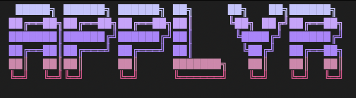

<p align="center">
  
</p>

# applyr

A local job-application agent for internship and new-grad roles.
It scrapes public boards, skips anything you've already seen,
tailors a resume and cover letter, applies on your behalf, pings
Discord with the outcome, and appends successful applications to
a Google Sheet tracker.

It's built on top of a coding agent — applyr is the workflow, the
agent is the executor.

> **Build 0.8.4a** — see [Release notes](docs/RELEASE.md) and
> [Changelog](docs/CHANGELOG.md).

## You need a coding agent

applyr doesn't work without one. It drives whichever you already
have installed. Full capability (browser-automated applies
included) with **[opencode](https://opencode.ai)** or
**[Claude Code](https://claude.com/claude-code)**.
[Codex CLI](https://developers.openai.com/codex/cli) and
[GitHub Copilot CLI](https://docs.github.com/copilot) work too,
but on a smaller path: API-fed boards only, with browser-only
applications routed to your review queue. The installer picks
up whatever you have and asks if you have more than one.

## Install

**macOS / Linux:**

```bash
curl -fsSL https://raw.githubusercontent.com/keshm2/applyr/main/scripts/install/install.sh | bash
```

**Windows (PowerShell):**

```powershell
irm https://raw.githubusercontent.com/keshm2/applyr/main/scripts/install/install.ps1 | iex
```

**Or via npm:**

```bash
npm install -g @keshm/applyr
applyr
```

**Or from a release archive** — see [docs/SETUP.md §1.4](docs/SETUP.md)
for the full curl/PowerShell snippets.

The installer drops applyr in `~/applyr` (or `%USERPROFILE%\applyr`
on Windows; override with `APPLYR_HOME`), asks for your coding
agent, your profile (kept **locally only** — gitignored files on
your machine, never uploaded), and whether you want Discord
status updates, creates the `data/resumes/` folder (add your base
resumes there — see [docs/SETUP.md](docs/SETUP.md) for the expected
filenames), and puts `applyr` on your PATH. When it finishes, just
type `applyr`.

You'll also need `python3`, `jq`, and (for the TUI) `node` ≥ 22
with `npm`. No `git` required.

## What it does each run

Scrape the configured boards → dedupe against your local history
→ fit-gate each posting (role/level, years, location) → tailor a
resume and cover letter for the survivors → apply through a
Playwright-controlled browser → record the outcome locally, send
the matching Discord webhook, and (on success) append a row to
the Sheet. Each run is capped at **25 applications** to stay
polite to upstream boards.

Workday is review-only on purpose — promising postings land in
your review queue, and you apply by hand.

## Using it

```bash
applyr                    # open the TUI (press ? for keys)
applyr status             # one-shot pipeline overview
applyr run                # one agent run in this terminal
applyr setup [--check]    # config wizard / validate only
applyr review | history   # jump straight to a screen

bash scripts/runtime/scheduler.sh install    # 30-minute always-on schedule (launchd)
```

Updates happen automatically — each run and TUI launch checks for
a newer build and installs it before continuing (your config,
data, logs, and resumes are never touched). Opt out with
`APPLYR_AUTO_UPDATE=0`, force one with `applyr update`. To
uninstall: `applyr uninstall`.

## Safety & privacy

These are how applyr is wired, not suggestions:

- **Personal data stays local.** Live configs, `data/` (incl.
  resumes), and `logs/` are gitignored and never leave your machine.
- **Form fields are filled only from `config/targets.json`
  `"safe_fields"`.** Passwords, SSNs, and payment info are
  never stored. A form asking for something outside safe_fields
  sends the job to review instead.
- **The browser extension never submits a form.** Autofill stops
  at a filled form; you click submit.
- **Discord is optional.** If you don't set it up, outcomes stay
  local — missing config is a warning, not an error.
- **Only successful applications sync to the Google Sheet.** A
  sync hiccup never turns a successful application into a
  failure.
- **Workday has no auto-apply path.** No workaround exists, and
  none is planned.

For the full walkthrough — boards, Discord webhooks, the Google
Sheets sync, per-agent quickstarts, the scheduler, and the
browser extension — see **[docs/SETUP.md](docs/SETUP.md)**.

## License

MIT.
